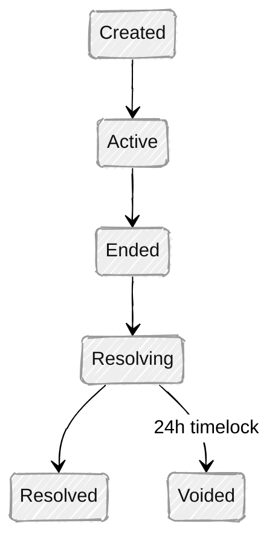

# Architecture & Settlement

This page covers the smart contract stack, market lifecycle, settlement mechanisms, and multi-chain capabilities that underpin PrometheX.

---

## Smart Contract Stack

PrometheX is built on a modular smart contract architecture deployed on **Arbitrum** (EVM-compatible L2). The stack consists of 9 core contracts:

| Contract | Role |
|----------|------|
| **PredictionFactory** | Market creation factory. Deploys APMM pools using EIP-1167 minimal proxies for gas-efficient cloning. UUPS upgradeable with role-based access control. |
| **PredictionCTF** | APMM liquidity pool. Implements weighted constant-product pricing with ERC-20 LP tokens and automatic fee accrual. |
| **ConditionalTokens** | ERC-1155 conditional token standard (Gnosis CTF compatible). Handles split, merge, and redeem operations for outcome tokens. |
| **CTFOracle** | Oracle coordinator. Routes market resolution to pluggable resolution modules (UMA, multisig, or custom). |
| **CTFSettlement** | CLOB settlement engine. Processes EIP-712 signed limit orders in batches via an operator. |
| **CTFRouter** | Transaction optimizer. Wraps multi-step operations (split + trade, merge + redeem) into single transactions. |
| **NegRiskRegistry** | Multi-outcome event manager. Maps N outcomes to N binary markets under a single event. |
| **NegRiskAdapter** | Multi-outcome orchestrator. Handles position conversion, redemption, and freeze logic across related markets. |
| **NegRiskExchange** | CLOB for multi-outcome markets with a 3-tier fee cascade (global → event → market). |

### Design Principles

- **Non-custodial** — All user funds are held by smart contracts, not by PrometheX or partners
- **Modular** — Each component is independently upgradeable and replaceable
- **Gas-optimized** — Minimal proxy clones (EIP-1167) reduce deployment cost per market to a fraction of a full contract deployment
- **Standard-compliant** — Built on established standards (ERC-1155, ERC-20, EIP-712, ERC-4337)

---

## Market Lifecycle

Every market follows a defined state machine from creation to resolution:

| State | APMM Trading | CLOB Trading | Resolution | Redemption |
|-------|:---:|:---:|:---:|:---:|
| **Active** | ✅ | ✅ | — | — |
| **Ended** | — | — | Proposable | — |
| **Resolving** | — | — | Dispute window | — |
| **Resolved** | — | — | Final | ✅ |
| **Voided** | — | — | Cancelled | ✅ (refund) |

**Key safeguards:**
- **24-hour void timelock** — Markets cannot be cancelled instantly; a mandatory delay prevents abuse
- **Flash-loan protection** — Deposit-and-trade in the same block is prohibited
- **Reentrancy guards** — All state-changing functions are protected

---

## Settlement & Resolution

PrometheX supports **modular settlement** — the resolution mechanism is pluggable per market, allowing partners to choose the trust model that fits their use case.

### Option 1: UMA Optimistic Oracle

The default decentralized resolution path using **UMA's Optimistic Oracle V3**:

1. **Propose** — Anyone can submit a resolution (e.g., "YES wins") along with a bond
2. **Dispute window** — A configurable liveness period (typically 2 hours) where anyone can challenge the proposal
3. **Resolve** — If undisputed, the resolution is accepted automatically. If disputed, UMA's decentralized arbitration decides
4. **Finalize** — The oracle reports payouts to ConditionalTokens, making winning tokens redeemable 1:1

**Best for:** Markets requiring decentralized, trust-minimized resolution (crypto prices, public events, elections).

### Option 2: Authorized Resolution

For markets where outcomes are determined by a trusted authority:

- An authorized operator (admin multisig or partner) submits the resolution directly
- No dispute window — immediate finalization
- Suitable when the outcome source is unambiguous (e.g., official sports scores, verified data feeds)

**Best for:** Partner-operated markets where speed and simplicity are priorities.

### Option 3: Custom Resolution Module

The CTFOracle supports **pluggable resolution modules** via a standard interface (`IResolutionModule`). Partners with specific requirements can implement custom resolution logic — for example, integrating with a proprietary data feed or a DAO governance vote.

---

## Multi-Outcome Markets (NegRisk)

For events with more than two outcomes (e.g., "Who will win the election?" with candidates A, B, C, D), PrometheX uses the **NegRisk** architecture:

### How It Works

1. One **event** is created with N outcomes
2. Each outcome becomes a **separate binary market** (YES/NO)
3. All markets share the same collateral pool and are linked through the NegRiskRegistry
4. Prices across all outcomes are constrained to sum to \$1.00

### Position Conversion

A unique feature of NegRisk: users can **convert** positions between outcomes without additional capital. Holding YES on outcome A is economically equivalent to holding NO on all other outcomes — and users can swap between these positions seamlessly.

### Resolution

- The winning outcome resolves as `[1, 0]` (YES wins, NO loses)
- All other outcomes resolve as `[0, 1]` (YES loses, NO wins)
- If an event is voided, all positions are refundable

---

## Non-Custodial Design

PrometheX enforces a strict non-custodial model:

| Principle | Implementation |
|-----------|---------------|
| **Collateral custody** | Locked in smart contracts — neither PrometheX nor partners hold user funds |
| **Supply invariant** | Total token supply always equals total collateral deposited |
| **Settlement guarantee** | Winning tokens redeem 1:1 for collateral — no redistribution or trust required |
| **Withdrawal rights** | Users can exit positions at any time while markets are active |

This design has important **compliance implications**: because no party takes custody of user assets, the platform operates as infrastructure rather than as a custodian.

---

## Multi-Chain Capability

PrometheX contracts are **EVM-compatible** and can be deployed to any EVM chain.

### Current Deployment

- **Network:** Arbitrum (L2 on Ethereum)
- **Advantages:** Low gas costs (\<\$0.01 per transaction), high throughput, full EVM compatibility, Ethereum security inheritance

### Supported Chains

Any EVM-compatible chain can be supported, including:

| Chain | Status |
|-------|--------|
| Arbitrum One | Production target (Q2 2026) |
| Base | Planned |
| Polygon | Planned |
| BSC | Validated (partner deployments) |
| Custom EVM chains | Available on request |

### Collateral Flexibility

- **Default:** USDC (6 decimals)
- **Supported:** Any standard ERC-20 token
- **Native tokens:** Supported via automatic wrapping (e.g., ETH → WETH, BNB → WBNB)
- **Automatic decimal handling:** The contract layer normalizes tokens of any decimal precision (0–18)

**Requirements for custom collateral tokens:**
- Standard ERC-20 interface (transfer, approve, balanceOf)
- Decimals ≤ 18
- No fee-on-transfer mechanism
- No rebase mechanism

Non-compliant tokens can be supported through a **WrappedCollateral** adapter that provides a standard 1:1 wrapper.

