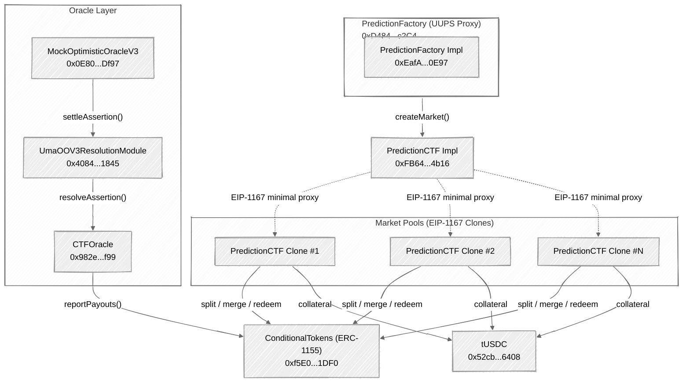

# Contract Addresses

All deployed PrometheX V2 smart contract addresses, organized by network.

---

## Arbitrum Sepolia (Testnet)

> **Note:** Chain ID: **421614** | RPC: `https://sepolia-rollup.arbitrum.io/rpc` | Explorer: [sepolia.arbiscan.io](https://sepolia.arbiscan.io)

### Core Contracts

| Contract | Address | Type | Status |
|----------|---------|------|--------|
| **ConditionalTokens** (ERC-1155) | [`0xf5E0891F0f5ba4C2b6034720b444eb79926e1DF0`](https://sepolia.arbiscan.io/address/0xf5E0891F0f5ba4C2b6034720b444eb79926e1DF0) | Singleton | Active |
| **PredictionFactory** (Proxy) | [`0xD4840C6aAF2e098e6B736e28c3B87DfD7b84c2C4`](https://sepolia.arbiscan.io/address/0xD4840C6aAF2e098e6B736e28c3B87DfD7b84c2C4) | UUPS Proxy | Active |
| **PredictionFactory** (Impl) | [`0xEafAF606fFC04fED313324679f58d60Ced7F0E97`](https://sepolia.arbiscan.io/address/0xEafAF606fFC04fED313324679f58d60Ced7F0E97) | Implementation | Active |
| **PredictionCTF** (Impl) | [`0xFB642D912f23BA19150d968104d4D988FA054b16`](https://sepolia.arbiscan.io/address/0xFB642D912f23BA19150d968104d4D988FA054b16) | EIP-1167 Clone Source | Active |

### Oracle & Resolution

| Contract | Address | Type | Status |
|----------|---------|------|--------|
| **CTFOracle** | [`0x982e18db6837D55297c39926dE86ae560cd96f99`](https://sepolia.arbiscan.io/address/0x982e18db6837D55297c39926dE86ae560cd96f99) | Oracle Adapter | Active |
| **UmaOOV3ResolutionModule** | [`0x4084526855cf8e6604623506dAB46A9d53941845`](https://sepolia.arbiscan.io/address/0x4084526855cf8e6604623506dAB46A9d53941845) | Resolution Module | Active |
| **MockOptimisticOracleV3** | [`0x0E80Ffb6D75C21b015c872923D7A6cD3e6B1Df97`](https://sepolia.arbiscan.io/address/0x0E80Ffb6D75C21b015c872923D7A6cD3e6B1Df97) | Mock Oracle (Testnet) | Active |

### Token Contracts

| Token | Address | Decimals | Notes |
|-------|---------|----------|-------|
| **tUSDC** | [`0x52cb113e383c654fB78Ff56615ce3719193C6408`](https://sepolia.arbiscan.io/address/0x52cb113e383c654fB78Ff56615ce3719193C6408) | 6 | Test USDC — free to mint via [faucet](https://faucet.promethex.market) |

### Infrastructure Contracts

| Contract | Address | Purpose |
|----------|---------|---------|
| **ERC-4337 EntryPoint** | [`0x5FF137D4b0FDCD49DcA30c7CF57E578a026d2789`](https://sepolia.arbiscan.io/address/0x5FF137D4b0FDCD49DcA30c7CF57E578a026d2789) | Account abstraction entry point (Alchemy) |
| **Multicall3** | [`0xcA11bde05977b3631167028862bE2a173976CA11`](https://sepolia.arbiscan.io/address/0xcA11bde05977b3631167028862bE2a173976CA11) | Batch contract reads |

---

## Arbitrum One (Mainnet)

> **Note:** Mainnet contracts are **not yet deployed**. This section shows the planned contract layout and known external contract addresses. Deployment is planned for a future release.

### Planned Contracts

| Contract | Address | Status |
|----------|---------|--------|
| **ConditionalTokens** | TBD | Not deployed |
| **PredictionFactory** (UUPS Proxy) | TBD | Not deployed |
| **PredictionCTF** (Clone Source) | TBD | Not deployed |
| **CTFOracle** | TBD | Not deployed |
| **UmaOOV3ResolutionModule** | TBD | Not deployed |

### Mainnet Network Details

| Property | Value |
|----------|-------|
| **Chain** | Arbitrum One |
| **Chain ID** | `42161` |
| **RPC** | `https://arb1.arbitrum.io/rpc` |
| **Explorer** | [arbiscan.io](https://arbiscan.io/) |

---

## External Contracts

These are third-party contracts on Arbitrum One that PrometheX integrates with:

| Contract | Address | Notes |
|----------|---------|-------|
| **USDC** (Circle) | [`0xaf88d065e77c8cC2239327C5EDb3A432268e5831`](https://arbiscan.io/address/0xaf88d065e77c8cC2239327C5EDb3A432268e5831) | Native USDC, 6 decimals |
| **UMA Optimistic Oracle V3** | [`0xa6B71E26C5e0845f74c812102Ca7114b6a896AB2`](https://arbiscan.io/address/0xa6B71E26C5e0845f74c812102Ca7114b6a896AB2) | Production oracle |
| **EntryPoint** (v0.6) | [`0x5FF137D4b0FDCD49DcA30c7CF57E578a026d2789`](https://arbiscan.io/address/0x5FF137D4b0FDCD49DcA30c7CF57E578a026d2789) | ERC-4337 |
| **Multicall3** | [`0xcA11bde05977b3631167028862bE2a173976CA11`](https://arbiscan.io/address/0xcA11bde05977b3631167028862bE2a173976CA11) | Batch read calls |

Key external integrations:

| Contract | Purpose | Docs |
|----------|---------|------|
| **Gnosis ConditionalTokens** | ERC-1155 conditional token standard | [CTF Docs](https://docs.gnosis.io/conditionaltokens/) |
| **UMA Optimistic Oracle V3** | Decentralized truth verification | [UMA Docs](https://docs.uma.xyz/) |
| **ERC-4337 EntryPoint** | Account Abstraction (gasless UX) | [ERC-4337](https://eips.ethereum.org/EIPS/eip-4337) |

---

## Contract Architecture

All PrometheX core contracts use OpenZeppelin's **UUPS upgradeable pattern**. The PredictionFactory is a UUPS proxy, and individual market pools are deterministic **EIP-1167 minimal proxy clones** of the PredictionCTF implementation. This means every market pool shares the same bytecode, reducing deployment gas costs significantly.



---

## Verifying Contracts

All contracts on Arbitrum Sepolia are verified on Arbiscan. You can inspect them as follows:

1. **Open the contract on Arbiscan** — Click any address link in the tables above to open it on the block explorer.
2. **Go to the Contract tab** — Select the **Contract** tab, then **Read Contract** or **Write Contract**.
3. **Connect your wallet (for writes)** — Click **Connect to Web3** to interact with write functions using your wallet.

**Reading contracts with viem:**

```typescript
import { createPublicClient, http } from "viem";
import { arbitrumSepolia } from "viem/chains";

const client = createPublicClient({
  chain: arbitrumSepolia,
  transport: http(),
});

// Read the PredictionFactory implementation address
const implAddress = await client.readContract({
  address: "0xD4840C6aAF2e098e6B736e28c3B87DfD7b84c2C4",
  abi: [
    {
      name: "implementation",
      type: "function",
      stateMutability: "view",
      inputs: [],
      outputs: [{ type: "address" }],
    },
  ],
  functionName: "implementation",
});
```

**Reading contracts with ethers.js:**

```typescript
import { ethers } from "ethers";

const provider = new ethers.JsonRpcProvider(
  "https://sepolia-rollup.arbitrum.io/rpc"
);

// Read the PredictionFactory implementation address
const factory = new ethers.Contract(
  "0xD4840C6aAF2e098e6B736e28c3B87DfD7b84c2C4",
  ["function implementation() view returns (address)"],
  provider
);

const implAddress = await factory.implementation();
```
